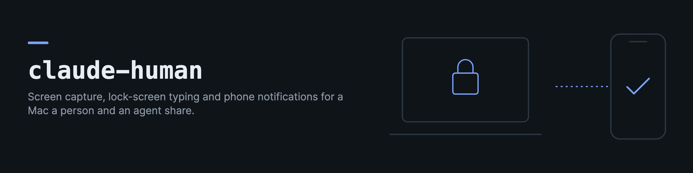

# claude-human

claude-human is a small set of tools for a Mac that a person and an agent share. I run a system on my own Mac that hands tasks to me on my phone when it needs a person (approve a password prompt, look at a window, type a password at the lock screen). These are the parts of it that are not tied to that system.

There are seven pieces.

- `claude_human.screenshot` captures the screen or one window through ScreenCaptureKit, lists the windows a person works in, and tells a locked screen apart from a password panel.
- `claude_human.unlock` types a password at the lock screen or into a SecurityAgent password panel through Karabiner's virtual HID keyboard, and then checks that it worked.
- `claude_human.station` shows one window of the Mac on a phone and turns the person's taps and keys into clicks and key presses on the Mac, so a person can do a step on the Mac from anywhere.
- `claude_human.notify` sends a message to a person through an ntfy server, with a file as the fallback, and plugs into a scheduled watcher.
- `claude_human.tasks` asks a person to do a step once, tells them, and closes the task only when a check says it is done. `claude-human task serve` serves the tasks over HTTP for an app.
- `@drkostas/claude-human-client` (in `client/`) is a typed TypeScript client for that server.
- `@drkostas/expo-ntfy` (in `js/`) gets messages from a self-hosted ntfy server to an Android phone without Firebase, through a native foreground service that an Expo config plugin adds to the app.

The Python parts need macOS, except `claude_human.notify`, which runs anywhere Python does. `@drkostas/expo-ntfy` needs an Expo app, and the client runs anywhere `fetch` does.

## Install

```bash
pip install 'claude-human[macos]'
claude-human build-tools
```

`build-tools` compiles the two helpers into `~/.local/share/claude-human/bin` (change it with `--out` or `CLAUDE_HUMAN_BIN_DIR`). It needs the Xcode command line tools and git. The lock screen helper also needs [Karabiner-Elements](https://karabiner-elements.pqrs.org/) installed, because it talks to Karabiner's virtual HID daemon.

```bash
claude-human build-tools --only sckshot --bundle-id org.example.sckshot --identity "Apple Development: Your Name (TEAMID)"
claude-human build-tools --only vhid --pqrs-commit <commit>
```

The signing identity defaults to the first "Apple Development" identity in your keychain, and to an ad-hoc signature when there is none. With an ad-hoc signature the Screen Recording grant does not survive a rebuild, because macOS ties it to the signature. Keep the bundle id the same between builds for the same reason. `--identity none` skips signing (CI uses it).

## Screenshots

```bash
claude-human windows                                   # the ordinary windows on screen, as JSON
claude-human screenshot --out screen.png               # the main display
claude-human screenshot --out safari.jpg --app Safari --max-width 1200
claude-human state                                     # locked? password panel up? a system dialog holding focus?
```

```python
from claude_human import screenshot

wid = screenshot.resolve("Safari", None)               # look the window up again on every request
jpeg, width, height = screenshot.frame(wid, max_width=1100, quality=0.55)
```

A few things I learned while building this.

- On recent macOS the older capture call (CGWindowListCreateImage) still works but is throttled to about one frame every 30 seconds. ScreenCaptureKit is not throttled, but its async completion never fires through PyObjC, so `sckshot` is a small Swift tool that the Python side runs. The old call is kept as a fallback.
- A window id changes every time its application restarts. Store the application name and look the id up again (`resolve`), or a stored id can reach a different window.
- When one window is asked for and the fallback cannot find its rectangle (for example, it is on another desktop), `capture` returns nothing. It never returns the whole screen in its place, because that would show every other window to someone who was given one.
- `frame` returns nothing at once while the session is locked. macOS refuses the capture then, and the fallback would block for 30 seconds and return black.
- A SecurityAgent password panel sets the same "locked" bit as the lock screen, while the desktop behind it is live. `auth_prompt()` finds the panel (a small SecurityAgent window, between the size of its helper windows and the size of the lock screen), and `frame` still captures when one is up.
- Without the Screen Recording grant, macOS lists windows with empty titles. Empty titles are the sign that the grant is missing.

## Handing a window to a person

The station is a small web server. It streams one window (or the whole display) as MJPEG, and its page turns the phone into a trackpad for that window. One finger moves a pointer drawn on the page, a tap clicks, a long press is a right click, two fingers scroll or pinch to zoom, and a double tap held down drags. There are buttons for the keyboard, Esc, Return, Tab and Spotlight.

```bash
claude-human station                          # http://127.0.0.1:8789/view, token in ~/.config/claude-human/station-token
claude-human station --app "System Settings"  # the token can reach this app's window and nothing else
claude-human prepare "System Settings" "open x-apple.systempreferences:com.apple.LoginItems-Settings.extension" "wait 1"
```

The station listens on 127.0.0.1 only, and it refuses any other address. Every click it accepts is a real click on the Mac, so reach it through something that adds its own login and encryption in front of it (a private network proxy such as `tailscale serve`, or an SSH tunnel), never directly.

The token travels only in the `Authorization: Bearer` header. The page at `/view` carries no secret. An app that embeds it hands the token in through `window.__stationGrant(token)` or a `postMessage` of `{type: "station:grant", grant}`, and a page opened in a plain browser asks for it in a password field. A token in a URL is ignored, because URLs end in histories, logs and share sheets.

```python
from claude_human.station import Grant, StationAuth, Unavailable, make_server

class MyAuth(StationAuth):
    def check(self, secret):                  # who is this token, right now
        task = my_store.task_for_token(secret)
        return Grant(master=False, station=task.window, holder=task.person) if task else None

    def app_for(self, grant):                 # the app this grant may drive (None is the whole display)
        try:
            return my_store.app_of(grant.station)
        except my_store.Down as e:
            raise Unavailable(str(e))         # refused, never widened to the whole display

    def perform(self, grant, act, run):       # a Spotlight press, to record who did it
        return run()

    def on_input(self, grant, msg, result):   # every tap and key, after it was handled
        pass

make_server(MyAuth(), port=8789).serve_forever()
```

How it keeps a person to the window they were given.

- `check` is asked on every request, so a grant you revoke stops working at once.
- A pinned grant (`master=False`) streams and drives the window of the app that `app_for` names, whatever the request asks for. It cannot list windows or choose a window id.
- When that app is not on the visible desktop, the picture ends and taps are refused. Neither falls back to the whole display, because the same point on the display is whatever the person at the Mac is looking at.
- When `app_for` cannot answer, it raises `Unavailable` and the request is refused. Returning None there would turn a passing database error into access to the whole screen.
- Taps are refused while the Mac is locked and while a system dialog holds focus, and the page says why. macOS drops synthetic input in both cases while it still reports success.
- The reason for a refusal goes to the server's log, never to the caller, and the token is never logged.
- Text is typed by pasting it and pressing Command+V, because synthetic characters do not reach SwiftUI text fields. The clipboard is put back afterwards.

`prepare` runs a recipe before the person arrives (`open`, `wait`, `search`, `type`, `key`, `click`, `scroll`, `activate`), so a shared window shows the item this task is about. `--phase place` runs only `open` and `wait`, which are safe on a desktop nobody is looking at. `--phase input` runs the rest once the person is looking at the window, because macOS sends a synthetic key to the frontmost app wherever it is. Every input step whose input the Mac refused is a failed step, and the run ends with `<app>: still open` only when the window is still there.

The station needs Screen Recording (for the picture and the window titles) and Accessibility (for the clicks) for the process that runs it.

## Typing at the lock screen and into password panels

The lock screen and SecurityAgent panels accept input only from real hardware. Synthetic key events, synthetic clicks and Screen Sharing input are all dropped there. Karabiner's DriverKit virtual HID keyboard is seen by macOS as a physical keyboard, so `vhid_type` can type where nothing else can.

```bash
claude-human unlock < password.txt       # type at the lock screen, then wait for the lock to clear
claude-human relock                      # sleep the display, then wait for the lock to set
claude-human use-password                # a Touch ID panel: press Return to switch to the password field
claude-human approve < password.txt      # type into the password panel, then wait for it to close
```

```python
from claude_human import unlock

ok, detail = unlock.unlock(password)                       # (True, "Unlocked.")
ok, detail = unlock.approve(password, prompt_present=my_detector)
```

How it behaves.

- The password goes to the helper on stdin. There is no command line option for it, and it never goes into argv, the environment or a log. When stdin is a terminal, the command asks for it without echo.
- Nothing is typed unless the target is there. `unlock` returns at once when the Mac is not locked, and `approve` refuses when no password panel is on screen.
- The result is checked, not assumed. `unlock` watches the lock bit clear, `approve` watches the panel close, and `relock` watches the lock bit set.
- The first keys at a lock screen are often lost because the field has not taken focus yet, so `unlock` tries a second time. It stops after two tries, because each try is a real password entry and macOS adds a delay after several wrong ones.
- The helper clears the field first (Cmd+A, Backspace) so leftover text cannot join the password.
- On the macOS password panel, Return does not press OK, and a synthetic click never reaches it. Space presses the focused button, so `approve` types the password, Tab, Tab and Space. This needs Full Keyboard Access to be on (System Settings > Keyboard), so that Tab reaches buttons.
- The helper runs under `sudo -n`, because the Karabiner daemon's socket is only open to root. Give your user a sudo rule for the helper's path, or run it as root.

Please read [SECURITY.md](SECURITY.md) before you use this part. It types a password, and it should only ever do that on your own Mac.

## Telling a person something

```bash
export CLAUDE_HUMAN_NTFY_TOKEN=tk_...            # read from the environment, never from an option
claude-human notify --url https://ntfy.example.org/alerts --title "Backup failed" --priority high "The nightly dump exited 1."
```

```python
from claude_human import notify

n = notify.from_env("https://ntfy.example.org/alerts")     # token or basic auth from the environment
ok, detail = n.notify("Backup failed", "The nightly dump exited 1.", priority="high",
                      link="myapp://task/42", tags=["warning"])
ok, messages = n.poll("10m")                                 # read back what the server holds
```

Every notifier returns `(ok, detail)` and never raises because the server was down or slow. `NtfyNotifier`, `FileNotifier` and `FirstThatWorks` (try each in order) all follow the `Notifier` protocol, so a program can swap one for another. `watch_sender` turns a notifier into the `send` argument of `claude_ops.watch.run_source`, so a scheduled watcher can tell a person instead of a Claude chat.

What it does for you.

- It publishes JSON, so titles and messages can hold any UTF-8 text. ntfy's header form encodes the title as latin-1 and fails on a Greek word or an emoji.
- It refuses a message whose click link, picture or button URL is on `localhost`, because the phone would open itself. Publishing to a server on `localhost` is fine.
- With `CLAUDE_HUMAN_NOTIFY_HOLD=1` set (in a test run, for example) it sends nothing and says so.
- `poll` turns `7d` into `168h`, because ntfy reads durations the Go way and has no day unit.

## Asking a person to do something

When an assistant needs a person for a step it cannot do itself (approve a permission, sign in, plug a cable in), it opens a task. `claude_human.tasks` keeps one open task per capability and subject, tells the person once, and closes the task only when a check says the thing is done. Pressing "done" runs the check. It never closes the task by itself.

```bash
claude-human task open connect device://backup-disk --reason "The nightly backup needs its disk." \
    --steps "Connect the backup disk to the Mac with its USB cable and wait for it to appear in Finder." \
    -- test -d /Volumes/Backup
claude-human task list                  # the open tasks, with the chain each reader can show
claude-human task verify                # run every open task's check, close the ones that pass
claude-human task serve --port 8790     # the same tasks over HTTP on 127.0.0.1, with a bearer token
```

```python
from claude_human import notify, tasks

engine = tasks.TaskEngine(tasks.SqliteTaskStore(), notifier=notify.from_env(), link="myapp://task/{id}")
task_id, new = engine.request(
    "approve", "app://backup", "The backup needs Full Disk Access.", owner="backup-bot",
    steps="System Settings > Privacy & Security > Full Disk Access > enable Backup",
    verify=["/usr/local/bin/backup", "--check-access"],
    handoffs=[tasks.Handoff("url", "x-apple.systempreferences:com.apple.preference.security?Privacy_AllFiles",
                            "Open the settings")])
engine.verify_pending()                 # on a schedule
```

The check after `--` is a list of arguments and runs without a shell. A string in its place is refused. A check that is missing, fails to start or runs past its timeout counts as "not done". The task file is `~/.local/share/claude-human/tasks.db` unless `CLAUDE_HUMAN_TASKS_DB` names another. Whether a task is open is derived from its events, and the file refuses any edit of an event.

A handoff is one way to put the person in front of the thing (a link, a station window, plain steps). The reader says what it can show (`supports`) and where it runs (`platform`), the server orders the chain, and the steps are always the last entry when the reader can show words. The app renders `head`, the first entry that is not words.

Every part can be replaced. A program with its own records implements `TaskStore` (and `HandoffResolver`, `Authorizer` or `Verifier` when it needs to) and keeps the engine. `Authorizer.may_act` refusals are recorded before they are raised.

The server answers `GET /pending`, `GET /task/<id>`, `GET /history`, `GET /comments`, `POST /done/<id>`, `POST /open/<id>`, `POST /comment/<id>` and `POST /withdraw/<id>`, and refuses to listen on anything but a loopback address. Its token is `CLAUDE_HUMAN_TASKS_TOKEN`, or the file `~/.config/claude-human/tasks-token`, made with mode 0600 on first use.

## Reading tasks from an app

`client/` is the npm package `@drkostas/claude-human-client`, a typed client for `claude-human task serve`. The base URL and the token are passed in, and the app says what it can show and where it runs.

```ts
import { createTaskClient } from "@drkostas/claude-human-client";

const tasks = createTaskClient({ baseUrl: "https://tasks.example.org", token, supports: ["steps", "url"], platform: "android" });
const pending = await tasks.pending();            // each task with its ordered chain and head
const answer = await tasks.done(pending[0].intent); // runs the check, answers what it saw
```

It covers every route of the server (`pending`, `task`, `open`, `done`, `comment`, `withdraw`, `history`, `comments`, `health`). See [client/README.md](client/README.md).

[examples/expo-tasks](examples/expo-tasks) is a small Expo app built on the client and `@drkostas/expo-ntfy`, with a list of waiting tasks, a task page with the handoff chain and the "I've done it, check" button, and the history.

## Phone notifications without Firebase

`js/` is the npm package `@drkostas/expo-ntfy`. It has a config plugin, the ntfy wire logic, and the Expo glue for notifications. See [js/README.md](js/README.md).

## What macOS needs

- Screen Recording for `sckshot.app` (fast capture), and for the process that lists windows (window titles and the fallback capture).
- Accessibility for the process that runs the station, so that its clicks and keys reach the Mac.

- Karabiner-Elements, with its driver extension allowed, for the virtual keyboard.
- Full Keyboard Access for `approve`.

macOS judges a process started by launchd by the binary that runs, so grant these to that interpreter and not only to your terminal.

A major macOS upgrade can reset these grants. Nothing can grant them again except a person in System Settings, which is how it should be.

## Claude Code skill

The package ships a Claude Code skill that teaches an agent how to use all of this safely. It covers building and signing the helpers, sending notifications and writing watchers, asking a person for a step with a task, the macOS grants and what resets them, the consent rules for typing a password, the Android delivery traps, and a catalogue of the failures behind each rule.

```bash
claude-human skill                      # writes ~/.claude/skills/claude-human/SKILL.md
claude-human skill --dir ./skills       # another skills folder
```

The same file is at [skill/SKILL.md](skill/SKILL.md) for anyone who uses only the npm package.

## Development

```bash
python -m venv .venv && .venv/bin/pip install -e '.[test,macos]'
.venv/bin/pytest
cd js && npm ci && npm test
cd client && npm ci && npm test
cd examples/expo-tasks && npm ci && npm run typecheck && npm test
```

The tests do not need any grant. They cover the argument parsing, the station server (run on a free port with a fake screen and a fake input sink), its input logic and recipe runner with a stand-in for Quartz, the path settings, the window and panel detection on recorded window lists, the typing logic with a fake helper, the notifier against a fake ntfy server in a thread, the task engine and its HTTP server against a temporary task file, the ntfy logic, the config plugin run against a fixture Android project, the task client against a fake `fetch` and against the real task server, and the example app's logic. On macOS one test also compiles `sckshot` without signing it.

## License

MIT
